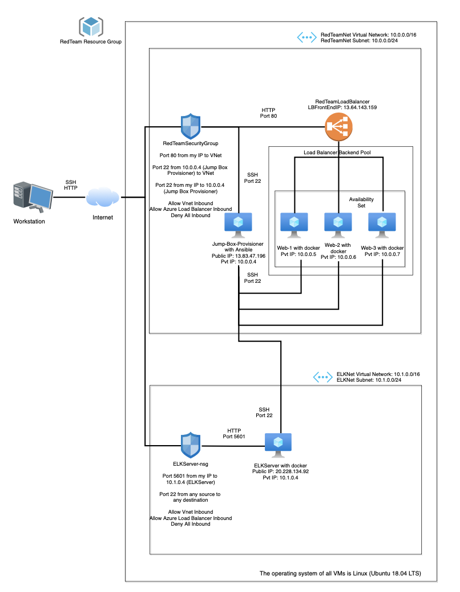
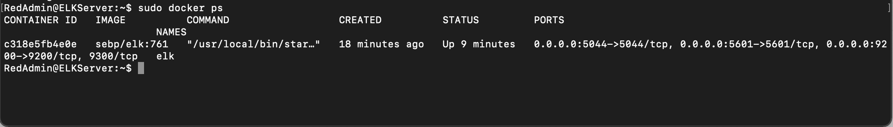

## Automated ELK Stack Deployment

The files in this repository were used to configure the network depicted below.



These files have been tested and used to generate a live ELK deployment on Azure. They can be used to either recreate the entire deployment pictured above. Alternatively, select portions of the following playbook files may be used to install only certain pieces of it, such as Filebeat.

* [my-playbook.yml](Ansible/my-playbook.yml) – playbook used to install D*mn Vulnerable Web App (DVWA) servers
* [install-elk.yml](Ansible/install-elk.yml) – playbook used to install ELK Server
* [filebeat-playbook.yml](Ansible/filebeat-playbook.yml) – playbook used to install and configure Filebeat on ELK Server and DVWA servers
* [metricbeat-playbook.yml](Ansible/metricbeat-playbook.yml) – playbook used to install and configure Metricbeat on ELK Server and DVWA servers

This document contains the following details:
- Description of the Topology
- Access Policies
- ELK Configuration
  - Beats in Use
  - Machines Being Monitored
- How to Use the Ansible Build


### Description of the Topology

The main purpose of this network is to expose a load-balanced and monitored instance of DVWA, the D*mn Vulnerable Web Application.

Load balancing ensures that the application will be highly available, in addition to restricting access to the network. A load balancer is placed in front of all machines in the virtual network, RedTeamNet.

What aspect of security do load balancers protect?

- A load balancer is used to distribute network traffic across several resources to prevent the overloading of a particular resource. From a security point of view, load balancers deploy network-based IDS/IPS systems and has the potential of preventing DDoS attacks by shifting the traffic directed towards an organizational network to a different network.

What is the advantage of a jump box?

- The jump box is placed in front of the other machines preventing their exposure to the public. These machines can be connected to using dynamic IP. We can restrict the IP addresses that can communicate with the jump box by creating inbound security rules in the network security groups.

Integrating an ELK server allows users to easily monitor the vulnerable VMs for changes to the file systems and system metrics.

What does Filebeat watch for?

- Filebeat monitors the log files or locations that is specified. It collects log events, and forwards them to Elasticsearch. It watches for file changes.

What does Metricbeat record?

 - Metricbeat records metrics from the operating system and services running on the server periodically.

The configuration details of each machine may be found below.

| Name                 	| Function   	|  IP Address 	| Operating System 	|
|----------------------	|------------	|-------------	|------------------	|
| Jump-Box-Provisioner 	| Gateway    	| 10.0.0.4    	| Linux            	|
| Web-1                	| Web Server 	| 10.0.0.5    	| Linux            	|
| Web-2                	| Web Server 	| 10.0.0.6    	| Linux            	|
| Web-3                	| Web Server 	| 10.0.0.7    	| Linux            	|
| ELKServer            	| Monitoring  	| 10.1.0.4    	| Linux            	|

The webservers belong to an availability set.

### Access Policies

The machines on the internal network are not exposed to the public Internet. 

Only the Jump box machine (Jump-Box-Provisioner) can accept connections from the Internet. Access to this machine is only allowed from the following IP addresses:

- Personal Public IP address

Machines within the network can only be accessed by using SSH from the jump box machine.

ELK VM can be accessed by SSH from the Jump box machine and from my personal machine using web access (TCP). 
Jump Box IP Address:  10.0.0.4 and Personal Public IP address.

A summary of the access policies in place can be found in the table below.

| Name                 	| Publicly Accessible 	| Allowed IP Addresses                                                            	|
|----------------------	|---------------------	|---------------------------------------------------------------------------------	|
| Jump-Box-Provisioner 	| Yes                 	| Personal Public IP Address                                                      	|
| Web-1                	| No                  	| 10.0.0.4 (Jumpbox Pvt IP) on port 22                                            	|
| Web-2                	| No                  	| 10.0.0.4 (Jumpbox Pvt IP) on port 22                                            	|
| Web-3                	| No                  	| 10.0.0.4 (Jumpbox Pvt IP) on port 22                                            	|
| ELKServer            	| Yes                 	| Personal Public IP Address on port 5601<br>10.0.0.4 (Jumpbox Pvt IP) on port 22 	|

### Elk Configuration

Ansible was used to automate configuration of the ELK machine. No configuration was performed manually, which is advantageous because there is minimal amount of error when automating the configurations.

What is the main advantage of automating configuration with Ansible?

- The main advantage of configuring with Ansible is that multiple servers can be easily configured, and programs and configurations can be updated on these servers at the same time irrespective of the number of servers.

The playbook implements the following tasks:

* Install docker.io
*	Install python3-pip
*	Install docker module
*	Increase virtual memory
*	Download and launch a docker elk container
*	Enable docker service on boot

The following screenshot displays the result of running `docker ps` after successfully configuring the ELK instance.



### Target Machines & Beats
This ELK server is configured to monitor the following machines:

*	Web-1 | 10.0.0.5
*	Web-2 | 10.0.0.6
*	Web-3 | 10.0.0.7

We have installed the following Beats on these machines:

*	[Filebeat](Ansible/filebeat-playbook.yml)
*	[Metricbeat](Ansible/metricbeat-playbook.yml)

These Beats allow us to collect the following information from each machine:

- Filebeat collects details about the file system like logs, changes to the files and remote access.

- Metricbeat collects system metrics like uptime, CPU usage and available memory.

### Using the Playbook
In order to use the playbook, you will need to have an Ansible control node already configured. Assuming you have such a control node provisioned: 

SSH into the control node and follow the steps below:
*	Copy the [filebeat-config.yml](Ansible/filebeat-config.yml) and [metribeat-config.yml](Ansible/metricbeat-config.yml) files to [/etc/ansible/files](Ansible/ansible.cfg).
*	Update the [/etc/ansible/hosts](Ansible/hosts) file to include the machines on which the ELK server and Filebeat should be installed. 

```
[webservers]
10.0.0.5 ansible_python_interpreter=/usr/bin/python3
10.0.0.6 ansible_python_interpreter=/usr/bin/python3
10.0.0.7 ansible_python_interpreter=/usr/bin/python3

[elk]
10.1.0.4 ansible_python_interpreter=/usr/bin/python3
```
*	Run the playbook and navigate to http://[ELK_Server_Public_IP]:5601 to check that the installation worked as expected.

With the help of Wireshark and Kibana, we can monitor the VMs to detect any suspicious authentication attempts.

<details><summary> <b> Click here for answers to potential interview questions based on the Automated ELK Server </b> </summary>

---

### Interview Questions and Answers

Question 1: Faulty Firewall

Suppose you have a firewall that's supposed to block SSH connections, but instead lets them through. How would you debug it?

1. Restate the problem

In order to restrict access to the VMs in your network, we need to deploy firewalls. Firewalls provide protection against outside cyberattacks by shielding the network from malicious traffic. A set of rules must be created to allow or deny traffic and access in the network. In case of an event where the firewall in place allows SSH connections when it is not supposed to, it can cause severe consequences like unauthorized access leading to breach of secure data.

2. Provide a Concrete Example Scenario

During the project on automated ELK server deployment which we had done during the cybersecurity bootcamp, we had set up a network with 4 VMs connected to another VM which was configured as a jump box. Only the jump box VM could be accessed from the Internet using SSH. The other VMs are accessed through the jump box using SSH. If we try to access a VM that does not accept SSH connections, our access will be denied since the security rules do not permit the access.

3. Explain the Solution Requirements

Only the jump box can connect using SSH to the other VMs while the VMs cannot to each using SSH. In case the VMs connect to each other using SSH, it would mean that the firewall rules are not configured to block the access or if the rules are already in place, it could be a security attack. Further, we would need to review the existing firewalls rules. To verify whether the rules are functional, we would conduct SSH login attempts on all the VMs.

4. Explain the Solution Details

On Azure UI, we can check the settings for the network security groups which lists down the currently set security rules in the network – destination ports, source, and destination. We can attempt SSH logins on all VMs from different IP addresses and between the VMs. We can test the connection for SSH for each VM to check if firewall allows/blocks the connection.

5. Identify Advantages/Disadvantages of the Solution

Since we have created an inbound security rule that Jump box can be only accessed from my personal IP address and other VMs can only be accessed through the jump box, I believe the solution guarantees that the Project 1 network is now "immune" to all unauthorized access.

</details>

---

#### Contents of Repository

- **Ansible**: Filebeat and Metricbeat configuration, Ansible configuration, hosts files, playbook files for installing ELK, Filebeat, Metricbeat and configuring the VM with Docker
- **Diagrams:** Network Diagrams from Networking and Cloud Security
- **Documentation:** Interview Questions, Kibana investigation report and Usage Instructions for Automated ELK Deployment
- **Images:** Images used in the README
- **Linux:** Shell scripts

---
