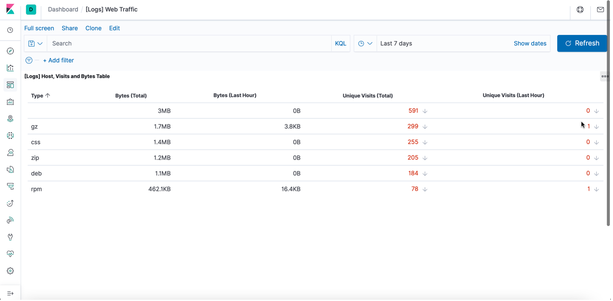
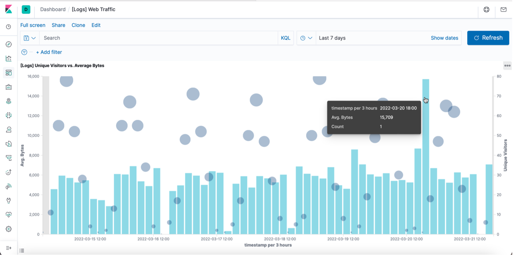
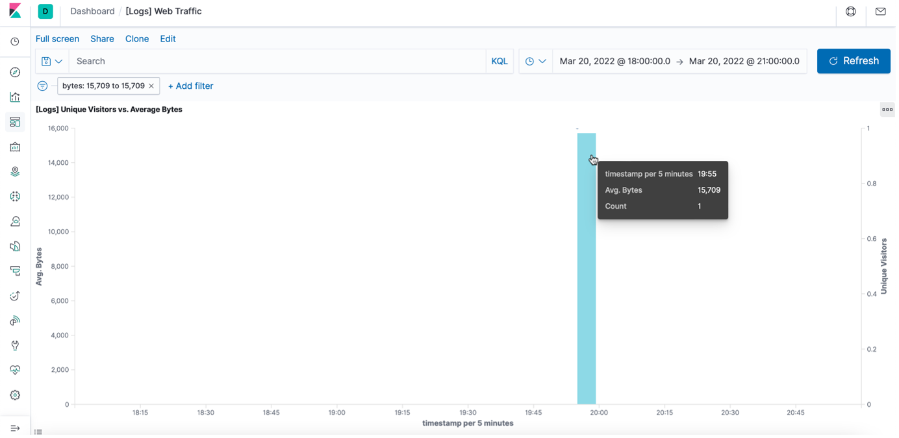
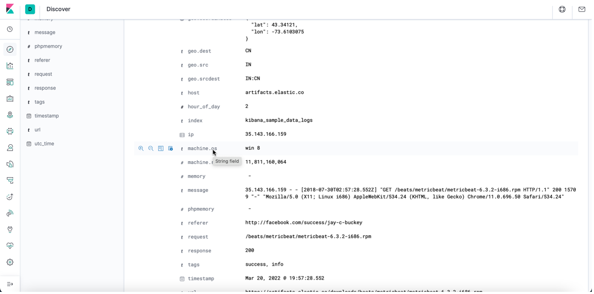
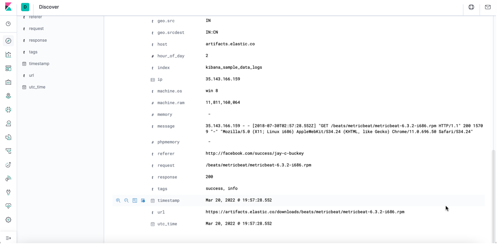

# Contents of Repository

- **Ansible**: Filebeat and Metricbeat configuration, Ansible configuration, hosts files, playbook files for installing ELK, Filebeat, Metricbeat and configuring the VM with Docker
- **Diagrams:** Network Diagrams from Networking and Cloud Security
- **Images:** Images used in the README
- **Linux:** Shell scripts
- **README.md:** Automated ELK Stack Deployment

---

## Automated ELK Stack Deployment

The files in this repository were used to configure the network depicted below.


These files have been tested and used to generate a live ELK deployment on Azure. They can be used to either recreate the entire deployment pictured above. Alternatively, select portions of the following playbook files may be used to install only certain pieces of it, such as Filebeat.

* [my-playbook.yml](Ansible/my-playbook.yml) – playbook used to install D*mn Vulnerable Web App (DVWA) servers
* [install-elk.yml](Ansible/install-elk.yml) – playbook used to install ELK Server
* [filebeat-playbook.yml](Ansible/filebeat-playbook.yml) – playbook used to install and configure Filebeat on ELK Server and DVWA servers
* [metricbeat-playbook.yml](Ansible/metricbeat-playbook.yml) – playbook used to install and configure Metricbeat on ELK Server and DVWA servers

This document contains the following details:
- Description of the Topology
- Access Policies
- ELK Configuration
  - Beats in Use
  - Machines Being Monitored
- How to Use the Ansible Build


### Description of the Topology

The main purpose of this network is to expose a load-balanced and monitored instance of DVWA, the D*mn Vulnerable Web Application.

Load balancing ensures that the application will be highly available, in addition to restricting access to the network. A load balancer is placed in front of all machines in the virtual network, RedTeamNet.

What aspect of security do load balancers protect?

- A load balancer is used to distribute network traffic across several resources to prevent the overloading of a particular resource. From a security point of view, load balancers deploy network-based IDS/IPS systems and has the potential of preventing DDoS attacks by shifting the traffic directed towards an organizational network to a different network.

What is the advantage of a jump box?

- The jump box is placed in front of the other machines preventing their exposure to the public. These machines can be connected to using dynamic IP. We can restrict the IP addresses that can communicate with the jump box by creating inbound security rules in the network security groups.

Integrating an ELK server allows users to easily monitor the vulnerable VMs for changes to the file systems and system metrics.

What does Filebeat watch for?

- Filebeat monitors the log files or locations that is specified. It collects log events, and forwards them to Elasticsearch. It watches for file changes.

What does Metricbeat record?

 - Metricbeat records metrics from the operating system and services running on the server periodically.

The configuration details of each machine may be found below.

| Name                 	| Function   	|  IP Address 	| Operating System 	|
|----------------------	|------------	|-------------	|------------------	|
| Jump-Box-Provisioner 	| Gateway    	| 10.0.0.4    	| Linux            	|
| Web-1                	| Web Server 	| 10.0.0.5    	| Linux            	|
| Web-2                	| Web Server 	| 10.0.0.6    	| Linux            	|
| Web-3                	| Web Server 	| 10.0.0.7    	| Linux            	|
| ELKServer            	| Monitoring  	| 10.1.0.4    	| Linux            	|

The webservers belong to an availability set.

### Access Policies

The machines on the internal network are not exposed to the public Internet. 

Only the Jump box machine (Jump-Box-Provisioner) can accept connections from the Internet. Access to this machine is only allowed from the following IP addresses:

- Personal Public IP address

Machines within the network can only be accessed by using SSH from the jump box machine.

ELK VM can be accessed by SSH from the Jump box machine and from my personal machine using web access (TCP). 
Jump Box IP Address:  10.0.0.4 and Personal Public IP address.

A summary of the access policies in place can be found in the table below.

| Name                 	| Publicly Accessible 	| Allowed IP Addresses                                                            	|
|----------------------	|---------------------	|---------------------------------------------------------------------------------	|
| Jump-Box-Provisioner 	| Yes                 	| Personal Public IP Address                                                      	|
| Web-1                	| No                  	| 10.0.0.4 (Jumpbox Pvt IP) on port 22                                            	|
| Web-2                	| No                  	| 10.0.0.4 (Jumpbox Pvt IP) on port 22                                            	|
| Web-3                	| No                  	| 10.0.0.4 (Jumpbox Pvt IP) on port 22                                            	|
| ELKServer            	| Yes                 	| Personal Public IP Address on port 5601<br>10.0.0.4 (Jumpbox Pvt IP) on port 22 	|

### Elk Configuration

Ansible was used to automate configuration of the ELK machine. No configuration was performed manually, which is advantageous because there is minimal amount of error when automating the configurations.

What is the main advantage of automating configuration with Ansible?

- The main advantage of configuring with Ansible is that multiple servers can be easily configured, and programs and configurations can be updated on these servers at the same time irrespective of the number of servers.

The playbook implements the following tasks:

* 	Install docker.io
*	Install python3-pip
*	Install docker module
*	Increase virtual memory
*	Download and launch a docker elk container
*	Enable docker service on boot

The following screenshot displays the result of running `docker ps` after successfully configuring the ELK instance.


### Target Machines & Beats
This ELK server is configured to monitor the following machines:

*	Web-1 | 10.0.0.5
*	Web-2 | 10.0.0.6
*	Web-3 | 10.0.0.7

We have installed the following Beats on these machines:

*	[Filebeat](Ansible/filebeat-playbook.yml)
*	[Metricbeat](Ansible/metricbeat-playbook.yml)

These Beats allow us to collect the following information from each machine:

- Filebeat collects details about the file system like logs, changes to the files and remote access.

- Metricbeat collects system metrics like uptime, CPU usage and available memory.

### Using the Playbook
In order to use the playbook, you will need to have an Ansible control node already configured. Assuming you have such a control node provisioned: 

SSH into the control node and follow the steps below:
*	Copy the [filebeat-config.yml](Ansible/filebeat-config.yml) and [metribeat-config.yml](Ansible/metricbeat-config.yml) files to [/etc/ansible/files](Ansible/ansible.cfg).
*	Update the [/etc/ansible/hosts](Ansible/hosts) file to include the machines on which the ELK server and Filebeat should be installed. 

```
[webservers]
10.0.0.5 ansible_python_interpreter=/usr/bin/python3
10.0.0.6 ansible_python_interpreter=/usr/bin/python3
10.0.0.7 ansible_python_interpreter=/usr/bin/python3

[elk]
10.1.0.4 ansible_python_interpreter=/usr/bin/python3
```
*	Run the playbook and navigate to http://[ELK_Server_Public_IP]:5601 to check that the installation worked as expected.

With the help of Wireshark and Kibana, we can monitor the VMs to detect any suspicious authentication attempts.

<details><summary><b> Click here for the report of the investigation completed using Kibana. </b> </summary>
<br> 
1.	In the last 7 days, how many unique visitors were located in India?

```Answer : 223```


	
2.	In the last 24 hours of the visitors from China, how many were using Mac OSX?
	
```Answer : 13```
	

	
3.	In the last 2 days, what percentage of visitors received 404 errors? How about 503 errors?

```Answer : 404 – 0% ; 503 – 0%```
	

 
4.	In the last 7 days, what country produced the majority of the traffic on the website?

```Answer : China```
	

 

5.	Of the traffic that's coming from that country, what time of day had the highest amount of activity?

```Answer : 10 am and 12 pm```
	


6.	List all the types of downloaded files that have been identified for the last 7 days, along with a short description of each file type.

- **gz:** .gz files are archived files compressed by the standard GNU zip (gzip) compression algorithm. It stands for Gnu Zipped Archive.
- **css:** .css files are used to format the contents of a webpage like indentation, font, size, color, line spacing, border and location of HTML information on a webpage. It stands for Cascading Style Sheet. 
- **zip:** .zip files are archive file that contains one or more compressed files or directories. It supports lossless data compression. It stands for zipped file.
- **deb:** A .deb file is a Debian Software Package file used by Debian Linux Distribution and its variants. Each DEB file is a standard Unix archive that contains two .tar archives: one for installer control information and another for installable data.
- **rpm:** .rpm file is an installation package originally developed for the Red Hat Linux operating system. It stands for Red Hat Package Manager File.



From Unique Visitors Vs. Average Bytes chart,

7.	Locate the time frame in the last 7 days with the most amount of bytes (activity).

```Answer: 6 pm on 20th March 2022```

 

8.	In your own words, is there anything that seems potentially strange about this activity?

```Answer: It is strange that a single visitor is using a much higher number of bytes (15709) than other visitors.```
	
On filtering the data by this event, 

9.	What is the timestamp for this event?

```Answer: The time stamp is 19:55 for the filter Mar 20, 2022 @ 18:00:0 Mar 20, 2022 @ 21:00:0.```



10.	What kind of file was downloaded?

```Answer:  An rpm file```


11.	From what country did this activity originate?

```Answer: India```
	


12.	What HTTP response codes were encountered by this visitor?

```Answer: 200```


Switch over to the Kibana Discover page,

13.	What is the source IP address of this activity?

```Answer: 35.143.166.159```

14.	What are the geo coordinates of this activity?

```Answer: { "lat": 43.34121, "lon": -73.6103075 }```
 


15.	What OS was the source machine running?

```Answer: Windows 8```

 

16.	What is the full URL that was accessed?

```Answer: https://artifacts.elastic.co/downloads/beats/metricbeat/metricbeat-6.3.2-i686.rpm```

  

17.	From what website did the visitor's traffic originate?

```Answer: Facebook```

  

18.	What do you think the user was doing?

```Answer:  I think the user was trying to download an installation package (Metricbeat) for Linux from the website.```

19.	Was the file they downloaded malicious? If not, what is the file used for?

```Answer: The installation does not seem malicious but could be. The file is usually used to download or update Metricbeat.```

20.	Is there anything that seems suspicious about this activity?

```Answer: Yes, the referrer for the download website was Facebook.```

21.	Is any of the traffic you inspected potentially outside of compliance guidelines?

```Answer: Since the download link was posted on Facebook, it might be outside of compliance guidelines. Ideally speaking, it is not expected to have a download/update link posted to social media.```

In order to verify the ELK Server is functioning properly and Filebeat and Metricbeat are collecting data correctly, the following tasks are performed:

1.	Generate a high amount of failed SSH login attempts and verify that Kibana is picking up this activity.
2.	Generate a high amount of CPU usage on the pen-testing machines and verify that Kibana picks up this data.
3.	Generate a high amount of web requests to your pen-testing servers and make sure that Kibana is picking them up.

#### Generate a high amount of failed SSH login attempts

1.	Instead of accessing the Web-1 through the Ansible container, we connect from the Jumpbox. This would record the failed login attempts because the Ansible container contains our SSH keys.

	```ssh RedAdmin@10.0.0.5```

2.	Ran the above command in a loop to generate failed login log entries.

	```for i in {1..10}; do ssh RedAdmin@10.0.0.5; done```

**Syntax breakdown:**
	
- `for` begins the `for` loop.
- `i` creates a variable named `i` that will hold each number in our list.
- `{1..10}` creates a list of 10 numbers, each of which will be given to our `i` variable.
- `;` separates the portions of `for` loop when written on one line.
- `do` indicates the action taken by each loop.
- `ssh RedAdmin@10.0.0.5` is the command `do` runs.
- `;` separates the portions of `for` loop when written on one line.
- `done` closes the `for`- loop.


3.	Checked Kibana logs if the login attempts were recorded.

 

**Bonus:** Created a nested loop that generates SSH login attempts across all webservers.

```while true; do for i in {5..7}; do ssh RedAdmin@10.0.0.$i; done; done```

**Syntax Breakdown:**

- `i` creates a variable named `i` that will hold each number in our list.
- `{5..7}` creates a list of numbers (5, 6 and 7), each of which will be given to `i` variable to represent the IP addresses of the webservers.
- `;` separates the portions of `for` loop when it is written on one line.
- `do` indicates the action taken each loop.
- `ssh RedAdmin@10.0.0.$i` is the command `do` runs . It is passing in the `$i` variable so the ssh command will be run on each webserver.
- `;` separates the portions of `for` loop when it is written on one line.
- `done` closes the for loop.

 

#### Generate a high amount of CPU usage on the pen-testing machines

1.	Started and attached to the Ansible container from the Jumpbox

	``sudo docker start competent_lumiere```
	``sudo docker attach competent_lumiere```

 

2.	Connected by SSH from the Ansible container to Web-1.

	```ssh RedAdmin@10.0.0.5```
	
  

3.	Intstalled the stress program.

	```sudo apt install stress```
	
  

4.	Let stress run for a few minutes.

	```sudo stress --cpu 1```
	
   

5.	Checked Kibana for the change in the system metrics.

   

6.	Ran the stress program on all three of the VMs and checked the Metric page on Kibana.

 
	
 
	
 
	
 
	
 
	
 
	

#### Generate a high amount of web requests to your pen-testing servers

1.	Logged into the Jumpbox.

	```ssh RedAdmin@13.83.47.196```

2.	Ran wget command to download index.html file.

	```wget 10.0.0.5```

3.	Listed the contents to view the fie downloaded.

	```ls```

4.	Ran a loop to generate a lot of web requests using wget.

	```for i in {1..10}; do wget 10.0.0.5; done```
	
**Syntax breakdown:**
	
- `for` begins the `for` loop.
- `i` in creates a variable named `i` that will hold each number in our list.
- `{1..10}` creates a list of 10 numbers, each of which will be given to our `i` variable.
- `;` separates the portions of `for` loop when written on one line.
- `do` indicates the action taken by each loop.
- `wget 10.0.0.5` is the command `do` runs.
- `;` separates the portions of `for` loop when written on one line.
- `done` closes the `for` loop

 

On checking the Metrics page for Web-1 on Kibana, the following was noted:


**Bonus:** Since `wget` creates a lot of duplicate files, we use `rm` command to delete all files. We use the following command not to save any files.

```while true; do wget 10.0.0.5 -O /dev/null; done```


 
**Bonus:** Write a nested loop that sends your wget command to all VMs over and over.
	
```while true; do for i in {5..7}; do wget -O /dev/null 10.0.0.$i; done; done```

**Syntax Breakdown:**
	
- `i` in creates a variable named `i` that will hold each number in our list.
- `{5..7}` creates a list of numbers (5, 6 and 7), each of which will be given to `i` variable to represent the IP addresses of the webservers.
- `;` separates the portions of `for` loop when it is written on one line.
- `do` indicates the action taken each loop.
- `wget 10.0.0.$i` is the command `do` runs . It is passing in the `$i` variable so the ssh command will be run on each webserver.
- `done` closes the `for` loop.
	


 </details>
 
---

<details><summary> <b> Click here for the usage instructions for Automated ELK Stack Deployment </b> </summary>
	

	
</details>

---

<details><summary> <b> Click here for answers to potential interview questions based on the Automated ELK Server </b> </summary>

---

### Interview Questions and Answers

Question 1: Faulty Firewall

Suppose you have a firewall that's supposed to block SSH connections, but instead lets them through. How would you debug it?

1. Restate the problem

In order to restrict access to the VMs in your network, we need to deploy firewalls. Firewalls provide protection against outside cyberattacks by shielding the network from malicious traffic. A set of rules must be created to allow or deny traffic and access in the network. In case of an event where the firewall in place allows SSH connections when it is not supposed to, it can cause severe consequences like unauthorized access leading to breach of secure data.

2. Provide a Concrete Example Scenario

During the project on automated ELK server deployment which we had done during the cybersecurity bootcamp, we had set up a network with 4 VMs connected to another VM which was configured as a jump box. Only the jump box VM could be accessed from the Internet using SSH. The other VMs are accessed through the jump box using SSH. If we try to access a VM that does not accept SSH connections, our access will be denied since the security rules do not permit the access.

3. Explain the Solution Requirements

Only the jump box can connect using SSH to the other VMs while the VMs cannot to each using SSH. In case the VMs connect to each other using SSH, it would mean that the firewall rules are not configured to block the access or if the rules are already in place, it could be a security attack. Further, we would need to review the existing firewalls rules. To verify whether the rules are functional, we would conduct SSH login attempts on all the VMs.

4. Explain the Solution Details

On Azure UI, we can check the settings for the network security groups which lists down the currently set security rules in the network – destination ports, source, and destination. We can attempt SSH logins on all VMs from different IP addresses and between the VMs. We can test the connection for SSH for each VM to check if firewall allows/blocks the connection.

5. Identify Advantages/Disadvantages of the Solution

Since we have created an inbound security rule that Jump box can be only accessed from my personal IP address and other VMs can only be accessed through the jump box, I believe the solution guarantees that the Project 1 network is now "immune" to all unauthorized access.

</details>

---
